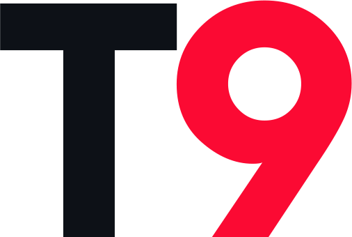

  <picture>
    <source media="(prefers-color-scheme: dark)" srcset="assets/logo.png">
    
  </picture>

<h1 align="center">Mod Manager</h1>

  <b>A mod launcher, script editor and mod loader for 
  Call of Duty: Black Ops Cold War Zombies.</b>

Pick your mods, start Cold War, and press **LOAD MODS** from the zombies pre-game menu. The launcher compiles them on your PC and loads them into the match you're about to start.

<!-- OWNER TODO: add a screenshot of the MODS page here -->

## How do you mod Call of Duty: Black Ops Cold War?

Mods on Cold War are code-only. The launcher compiles it and hands it to the running game as if it were one of the games own scripts, which then loads it along with everything else. That means no new maps, models, sounds or menus. However, there are many cool and creative ways you can mod the game and make it your own!
> [!WARNING]
> This is not a client. The process of loading mods involves injecting scripts. Doing this into the online game goes directly against Call of Duty Terms of Service. Although no one on the team has experienced this, there is always a risk of your account getting banned. **Use it at your own risk.**
>
> The launcher only loads mods in solo and Private matches, and refuses public ones. This is done to allow mods to be secure and moderated as well as prevent mods being loaded onto unsuspecting users.

## Features

**Playing mods**

- A browsable library of every published mod, with search, tag filters, ratings and favourites
- One-click download, update and removal, with every package verified on the way in
- Per-mod settings and presets, so one mod can be several without republishing
- Load several mods at once, with a warning when two of them clash

**Making mods**

- A GSC editor built for Cold War: autocomplete over the real API, live linting, multi-caret editing, project-wide search, folding, snippets and rebindable keys
- Multi-file projects that link into one script. Compiler errors point at the line you actually wrote
- Support for client scripts (`.csc`)
- A hash finder for Cold War's hashed names, both directions
- Co-authoring: invite someone, work on a shared copy, sync both ways without overwriting each other
- Submit straight from the tools for review and publishing

## What mods are allowed

T9 Mod Manager is for mods that make zombies more fun. Every mod is reviewed by a person before it is published. We do not allow any mod that exploits the game, unlocks or changes anything tied to a player's account, targets other players, or gives the host an unfair advantage.

## Safety

- **Every published mod was read by a human before it went up**, then signed. The launcher won't load a package it can't verify that signature on.
- **The match-type check is built into the mod itself**, so it still applies however the mod was loaded.
- **Nothing is written to your game install.** The script goes into the running match and a map restart clears it. No game files are touched.

## Requirements

| Requirement | Notes |
| --- | --- |
| **Windows PC** | The launcher works on the running game, so it has to be the same PC you play on. |
| **Call of Duty: Black Ops Cold War** | Steam or Battle.net. Console players can join a modded private lobby, but only the PC host loads mods. |
| **A Discord account** | Optional. Only needed for the mod tools and for rating mods. Downloading and playing mods never asks for it. |

## Download

Grab the installer from the [Releases page](../../releases).

It installs per-user and doesn't ask for administrator rights. Everything lives next to the launcher's own .exe (settings, downloaded mods, your projects), so pick a folder your account can write to. It checks for updates on startup, and from SETTINGS whenever you want.

<!-- OWNER TODO: if the build is not code-signed, add a line here about the Windows SmartScreen warning -->

## Documentation

The wiki, in the `wiki` folder, has the rest: setting up, downloading and loading mods, and mod settings. If you want to make mods there's a full course, from your first script through the editor, multi-file projects, scripting guides, a GSC reference and how Cold War's own systems work. Troubleshooting is in there too.

## Community

Mod review, co-authoring, release announcements and LFG channels all run on the **T9 Modding** Discord.

## Credits

The launcher's GSC compiler is built on [**Atian CoD Tools**](https://github.com/ate47/atian-cod-tools) by ate47, used under the [MIT licence](https://github.com/ate47/atian-cod-tools/blob/main/LICENSE.md).

Hashed names are resolved using [HashIndex](https://github.com/ate47/HashIndex) by ate47 and [hash-slinging-slasher](https://github.com/KingslayerKyle/hash-slinging-slasher) by KingslayerKyle.

## Licence

Copyright (c) 2026 The T9 Mod Manager Team. All rights reserved. Free to download and use; see [LICENSE](LICENSE).

T9 Mod Manager is an unofficial, fan-made tool. It is not affiliated with, endorsed by or associated with Activision Publishing, Inc. or Treyarch.
